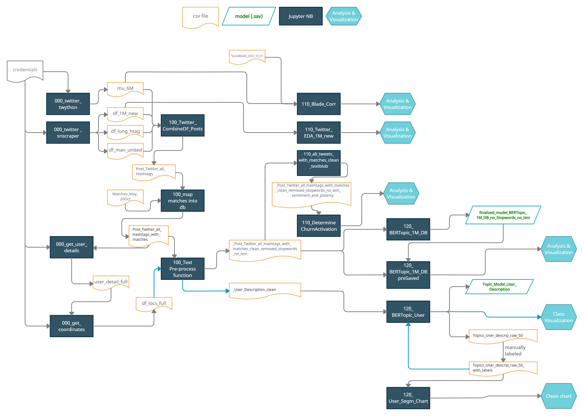
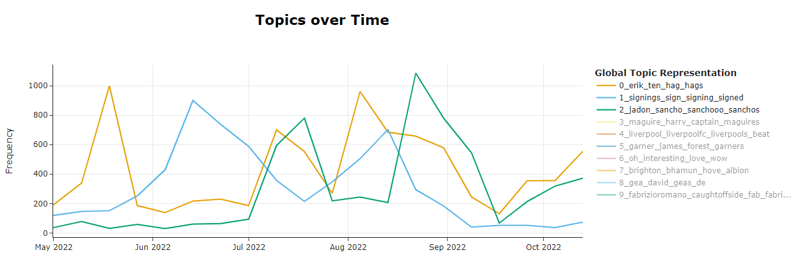
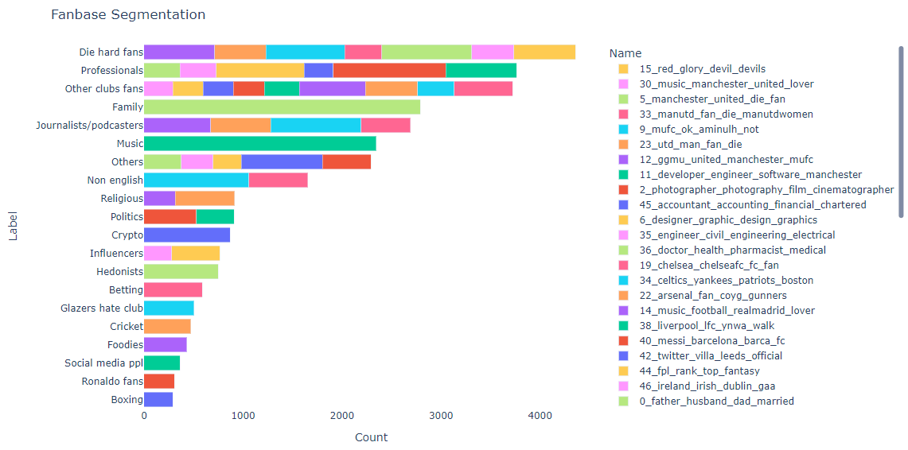



# Sport team fanbase social media analytics
This repository contains SIT Academy Data Science students' final project on Social Media Analytics using NLP.

## Project Sponsor: 

[SIT Autonomous](https://sit.auto/)

## Students

[Naemi Graf](https://www.linkedin.com/in/naemi-graf-0b434a13a/), [Joana Duarte](https://www.linkedin.com/in/joanaduartesantos/) , [Mihaela Cucui](www.linkedin.com/in/mihaela-cucui-642789b5)

## Supervisors

[Ekaterina Butyugina](https://www.linkedin.com/in/ekaterina-butyugina/), [Dipanjan Sarkar](https://www.amazon.in/Dipanjan-Sarkar/e/B01M100PAR%3Fref=dbs_a_mng_rwt_scns_share)

## Purpose

Sit Autonomous is a company specialized in Machine Intelligence consulting services in driverless mobility, robotics, and professional sports. 
The purpose of the project was to better understand how teams could utilize their social media presence to become more successful in growing and engaging their supporters.
The goals of the project were assessing the social media presence of a football team, segmenting their fanbase and providing recommendations on how to grow and engage with their fans.

## Data

We selected the Manchester United team as their social media presence is strong, and we selected Twitter as the social media platform as its data is the most available through an API. We also explored obtaining data from other prominent social media platforms, but their API either wasn’t accessible or no useful information could be obtained from it.
We managed to collect tweets and some user information through the Twitter API.

The data and models are available on [gdrive](https://drive.google.com/drive/folders/1P9Od8t9cquMC-SGPNN6t81N6XgIwc06l?usp=share_link).

## Requirements

The [Environment](dev-environment.yml)
 file contains all the necessary python packages.  

## How to work with this repo

### Part 1. Processing the data

The twitter scrapping (000_) and pre-processing notebooks (100_) should to be run in a sequence, as described in the flowchart above.

### Part 2. Analysis

The notebooks in the categories (110_) and (120_) contain various analyses performed such as correlation analysis between no. of likes/retweets and no. of followers added, churn and activation of user, sentiment analysis through time/per match as well as BERTopic modelling. The BERTopic and sentiment_BERT notebooks should be ran on COLAB.

The additional notebooks not included in the current flowchart include further details that were collected but could not be yet analysed in detail.

### Part 3. Example results

Below are two charts displaying the most frequent topics as well as the user segmentation using the BERTopic model. 
Additional html charts are available in the [Streamlit App](https://jdfduarte-social-media-analysis-streamlit-st-app-qazofo.streamlit.app/).

